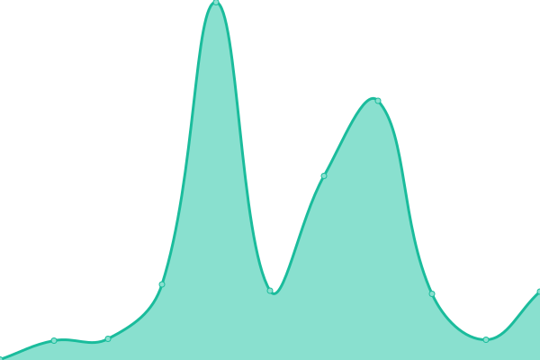

# [📈 Live Status](https://deutsch-thomas.github.io/upptime-monitor): <!--live status--> **🟧 Partial outage**

This repository contains the open-source uptime monitor and status page for [deutsch-thomas](https://deutsch-thomas.github.io/upptime-monitor), powered by [Upptime](https://github.com/upptime/upptime).

With [Upptime](https://upptime.js.org), you can get your own unlimited and free uptime monitor and status page, powered entirely by a GitHub repository. We use [Issues](https://github.com/deutsch-thomas/upptime-monitor/issues) as incident reports, [Actions](https://github.com/deutsch-thomas/upptime-monitor/actions) as uptime monitors, and [Pages](https://deutsch-thomas.github.io/upptime-monitor) for the status page.

<!--start: status pages-->
<!-- This summary is generated by Upptime (https://github.com/upptime/upptime) -->
<!-- Do not edit this manually, your changes will be overwritten -->
<!-- prettier-ignore -->
| URL | Status | History | Response Time | Uptime |
| --- | ------ | ------- | ------------- | ------ |
|  [Grafana](https://grafana.monitor.bluectrl.at/) | 🟥 Down | [grafana.yml](https://github.com/deutsch-thomas/upptime-monitor/commits/HEAD/history/grafana.yml) | 

 1164ms
     
 | 

<a href="https://uptime.monitor.bluectrl.at/history/grafana">99.81%</a>
    

|  [InfluxDB](https://influxdb.monitor.bluectrl.at/) | 🟥 Down | [influx-db.yml](https://github.com/deutsch-thomas/upptime-monitor/commits/HEAD/history/influx-db.yml) | 

 408ms
     
 | 

<a href="https://uptime.monitor.bluectrl.at/history/influx-db">99.61%</a>
    

|  [RabbitMQ](https://rabbitmq.monitor.bluectrl.at/) | 🟥 Down | [rabbit-mq.yml](https://github.com/deutsch-thomas/upptime-monitor/commits/HEAD/history/rabbit-mq.yml) | 

 409ms
     
 | 

<a href="https://uptime.monitor.bluectrl.at/history/rabbit-mq">99.81%</a>
    

|  [Loki](https://loki.monitor.bluectrl.at//) | 🟩 Up | [loki.yml](https://github.com/deutsch-thomas/upptime-monitor/commits/HEAD/history/loki.yml) | 

 382ms
     
 | 

<a href="https://uptime.monitor.bluectrl.at/history/loki">100.00%</a>
    

|  [Live-BlueCtrl](https://bluectrl.at) | 🟩 Up | [live-blue-ctrl.yml](https://github.com/deutsch-thomas/upptime-monitor/commits/HEAD/history/live-blue-ctrl.yml) | 

 244ms
     
 | 

<a href="https://uptime.monitor.bluectrl.at/history/live-blue-ctrl">100.00%</a>
    

|  [Live-API-BlueCtrl](https://api.bluectrl.at/docs#/) | 🟩 Up | [live-api-blue-ctrl.yml](https://github.com/deutsch-thomas/upptime-monitor/commits/HEAD/history/live-api-blue-ctrl.yml) | 

 540ms
     
 | 

<a href="https://uptime.monitor.bluectrl.at/history/live-api-blue-ctrl">100.00%</a>
    

|  [Stage-BlueCtrl](https://stage.bluectrl.at) | 🟩 Up | [stage-blue-ctrl.yml](https://github.com/deutsch-thomas/upptime-monitor/commits/HEAD/history/stage-blue-ctrl.yml) | 

 477ms
     
 | 

<a href="https://uptime.monitor.bluectrl.at/history/stage-blue-ctrl">100.00%</a>
    

|  [Stage-API-BlueCtrl](https://stage.api.bluectrl.at/docs#/) | 🟩 Up | [stage-api-blue-ctrl.yml](https://github.com/deutsch-thomas/upptime-monitor/commits/HEAD/history/stage-api-blue-ctrl.yml) | 

 450ms
     
 | 

<a href="https://uptime.monitor.bluectrl.at/history/stage-api-blue-ctrl">100.00%</a>
    

|  [Demo-BlueCtrl](https://demo.bluectrl.at) | 🟩 Up | [demo-blue-ctrl.yml](https://github.com/deutsch-thomas/upptime-monitor/commits/HEAD/history/demo-blue-ctrl.yml) | 

 520ms
     
 | 

<a href="https://uptime.monitor.bluectrl.at/history/demo-blue-ctrl">100.00%</a>
    

|  [Stage-API-BlueCtrl](https://demo.api.bluectrl.at/docs#/) | 🟩 Up | [stage-api-blue-ctrl.yml](https://github.com/deutsch-thomas/upptime-monitor/commits/HEAD/history/stage-api-blue-ctrl.yml) | 

 450ms
     
 | 

<a href="https://uptime.monitor.bluectrl.at/history/stage-api-blue-ctrl">100.00%</a>
    

|  [V2-BlueCtrl](https://v2.bluectrl.at) | 🟩 Up | [v2-blue-ctrl.yml](https://github.com/deutsch-thomas/upptime-monitor/commits/HEAD/history/v2-blue-ctrl.yml) | 

 435ms
     
 | 

<a href="https://uptime.monitor.bluectrl.at/history/v2-blue-ctrl">100.00%</a>
    

<!--end: status pages-->

[**Visit our status website →**](https://deutsch-thomas.github.io/upptime-monitor)

## 📄 License

- Powered by: [Upptime](https://github.com/upptime/upptime)
- Code: [MIT](./LICENSE) © [Anand Chowdhary](https://anandchowdhary.com), supported by [Pabio](https://pabio.com)
- Data in the `./history` directory: [Open Database License](https://opendatacommons.org/licenses/odbl/1-0/)
